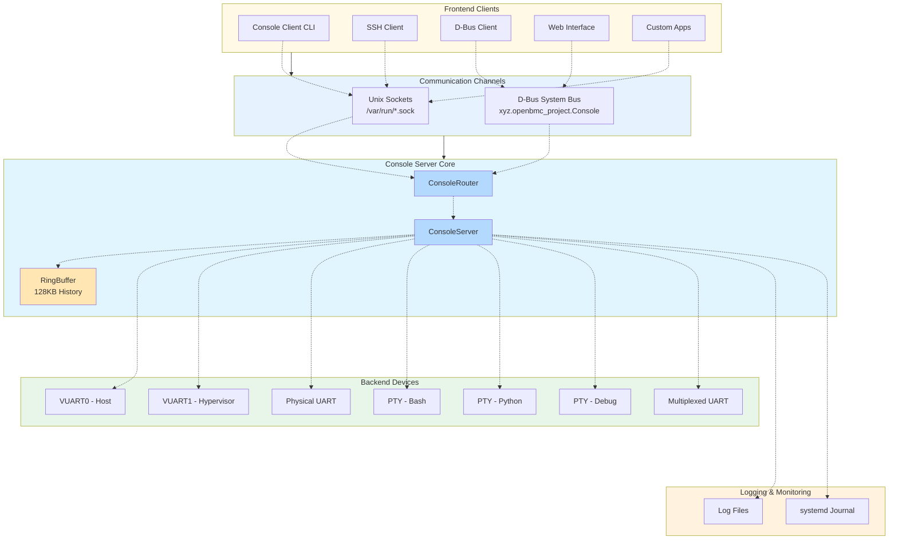

# OpenBMC Console Server

A modern C++ implementation of the OpenBMC console server using Boost.Asio coroutines and D-Bus integration.

## Features

- **UART/Serial Device Management**: Manages serial console devices with configurable baud rates
- **Unix Socket Interface**: Direct client connections via Unix domain sockets
- **D-Bus Interface**: Full D-Bus integration with file descriptor passing
  - `xyz.openbmc_project.Console.Access.Connect()` - Returns file descriptor for console access
  - `xyz.openbmc_project.Console.UART.Baud` - Get/set baud rate property
- **Console History**: Automatic replay of console history to new clients (128KB buffer)
- **Multiple Clients**: Supports multiple simultaneous client connections
- **Async I/O**: Built on Boost.Asio coroutines for efficient non-blocking operations

## Building

```bash
meson setup builddir
ninja -C builddir
sudo ninja -C builddir install
```

## Installation

The build system installs:
- `/usr/bin/console_server` - Server executable
- `/usr/bin/console_client` - Client executable
- `/lib/systemd/system/console_server.service` - Systemd service file
- `/etc/obmc-console.conf.example` - Example configuration file

## Configuration

1. Copy the example configuration:
```bash
sudo cp /etc/obmc-console.conf.example /etc/obmc-console.conf
```

2. Edit `/etc/obmc-console.conf`:
```ini
# UART device path
device = /dev/ttyS0

# Baud rate
local-tty-baud = 115200

# Unix socket path
socket-path = /tmp/obmc-console.sock

# Log configuration
logfile = /var/log/obmc-console.log
logsize = 256k
```

## Running

### As a systemd service:

```bash
# Enable and start the service
sudo systemctl enable console_server.service
sudo systemctl start console_server.service

# Check status
sudo systemctl status console_server.service

# View logs
sudo journalctl -u console_server.service -f
```

### Manually:

```bash
# With default console ID
console_server /etc/obmc-console.conf

# With custom console ID
console_server /etc/obmc-console.conf ttyS1
```

## Usage

### Via Unix Socket (console_client):

```bash
console_client /tmp/obmc-console.sock
```

### Via D-Bus:

```bash
# Connect and get file descriptor
busctl call xyz.openbmc_project.Console.default \
  /xyz/openbmc_project/console/default \
  xyz.openbmc_project.Console.Access Connect

# Get current baud rate
busctl get-property xyz.openbmc_project.Console.default \
  /xyz/openbmc_project/console/default \
  xyz.openbmc_project.Console.UART Baud

# Set baud rate
busctl set-property xyz.openbmc_project.Console.default \
  /xyz/openbmc_project/console/default \
  xyz.openbmc_project.Console.UART Baud t 115200
```

## Architecture

### System Architecture Diagram



### Components

1. **ConsoleServer**: Main server class managing UART and client connections
2. **ConsoleRouter**: Handles individual client connections and data routing
3. **ConsoleDbusInterface**: D-Bus interface implementation
4. **SocketPairConsumer**: Manages socket pairs for D-Bus clients
5. **UartDevice**: UART device wrapper with async I/O

### Communication Channels

#### Unix Domain Sockets
- **Path**: `/var/run/obmc-console-*.sock`
- **Protocol**: Stream sockets (SOCK_STREAM)
- **Usage**: Direct client connections, SSH forwarding
- **Features**: Low latency, file system permissions

#### D-Bus System Bus
- **Service**: `xyz.openbmc_project.Console.<console-id>`
- **Object Path**: `/xyz/openbmc_project/console/<console-id>`
- **Interfaces**:
  - `xyz.openbmc_project.Console.Access` - Connect() method
  - `xyz.openbmc_project.Console.UART` - Baud property
- **Features**: File descriptor passing, property notifications

#### File Descriptor Passing
- **Mechanism**: `socketpair()` + `SCM_RIGHTS`
- **Usage**: D-Bus clients receive dedicated socket pair
- **Benefits**: Efficient zero-copy data transfer

### Backend Device Types

#### VUART (Virtual UART)
- **Devices**: `/dev/ttyVUART0`, `/dev/ttyVUART1`
- **Type**: LPC-based virtual serial ports
- **Configuration**: LPC address, SIRQ
- **Use Cases**: Host console, hypervisor debug

#### Physical UART
- **Devices**: `/dev/ttyS0-S3`
- **Type**: Hardware serial ports
- **Configuration**: Baud rate (115200 default)
- **Use Cases**: External device consoles

#### PTY (Pseudo-Terminal)
- **Devices**: `/dev/ptmx` (dynamically allocated)
- **Type**: Virtual terminal pairs
- **Configuration**: Shell path and arguments
- **Use Cases**: Interactive shells (bash, python, sh)

#### Multiplexed UART
- **Devices**: Shared physical UART
- **Type**: GPIO-controlled multiplexing
- **Configuration**: GPIO pins for selection
- **Use Cases**: Multiple devices on single UART

### Data Flow

### D-Bus Integration

The server implements two D-Bus interfaces:

1. **xyz.openbmc_project.Console.Access**
   - `Connect()` method: Creates a socket pair and returns the client FD
   - Enables file descriptor passing for efficient console access

2. **xyz.openbmc_project.Console.UART**
   - `Baud` property: Get/set UART baud rate
   - Automatically reconfigures UART device on change

## Comparison with C Implementation

| Feature | C Implementation | C++ Implementation |
|---------|-----------------|-------------------|
| I/O Model | Poll-based | Async coroutines |
| D-Bus | sd-bus | sdbusplus |
| Memory | Manual malloc/free | RAII + smart pointers |
| Socket Pairs | socketpair() + poll | socketpair() + Boost.Asio |
| Client Management | Reallocarray | std::vector |

## Troubleshooting

### Service fails to start

Check the configuration file:
```bash
console_server /etc/obmc-console.conf
```

### UART device not accessible

Ensure the device exists and has proper permissions:
```bash
ls -l /dev/ttyS0
sudo chmod 666 /dev/ttyS0  # Or add user to dialout group
```

### D-Bus connection fails

Verify D-Bus is running and the service is registered:
```bash
busctl list | grep Console
```

### No console output

Check UART device configuration and baud rate:
```bash
stty -F /dev/ttyS0
```

## License

Apache License 2.0

## See Also

### Single Console Server
- [console_dbus.hpp](../../include/console_dbus.hpp) - D-Bus interface implementation
- [console_server.cpp](console_server.cpp) - Main server implementation
- [console_config.hpp](console_config.hpp) - Configuration parser

### Multi-Console Server
- [console_server_multi.cpp](console_server_multi.cpp) - Multi-console server implementation
- [obmc-console-multi.conf](obmc-console-multi.conf) - Multi-device configuration example
- Supports multiple simultaneous console devices (VUART, UART, PTY shells)
- Each console has independent socket path and D-Bus interface