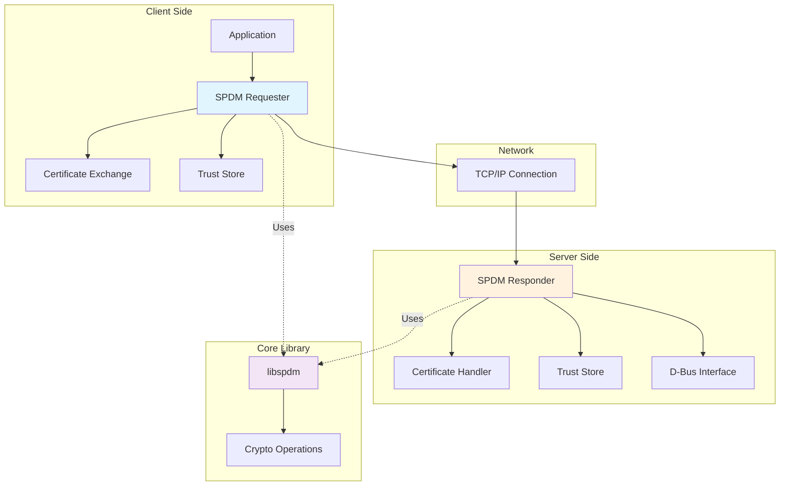
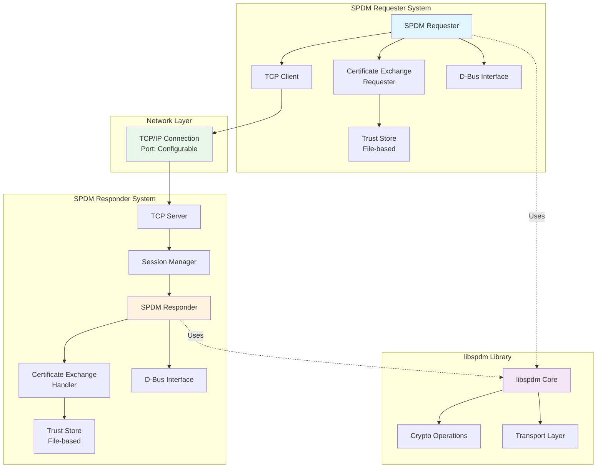
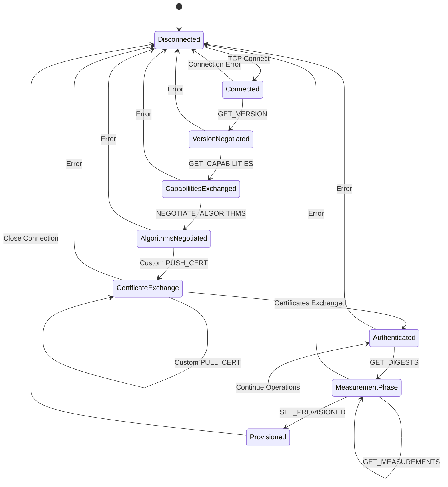
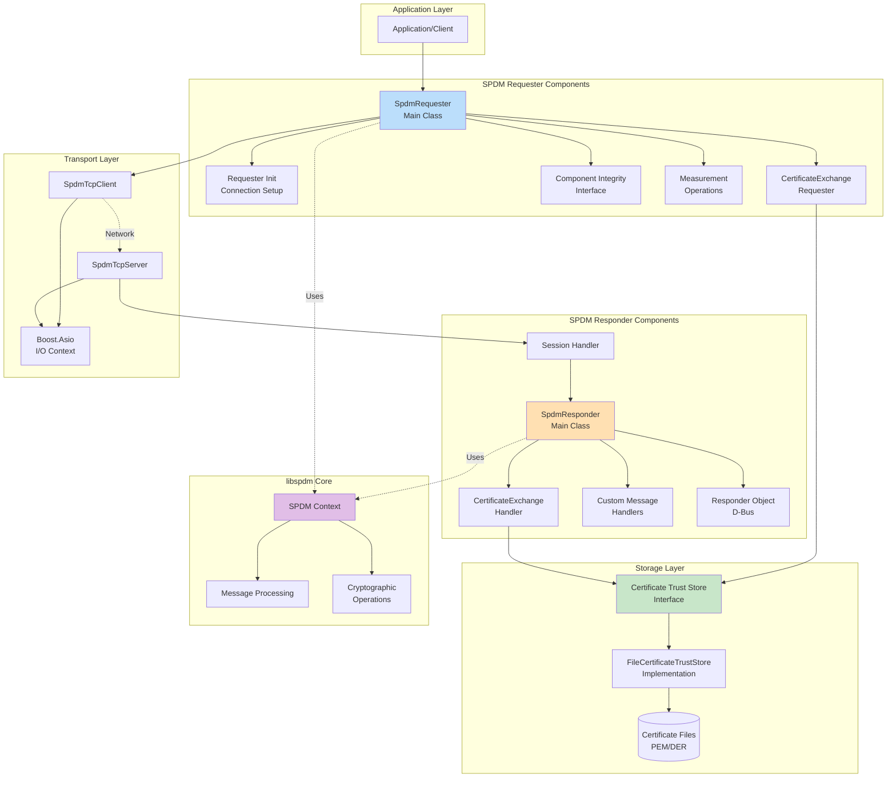
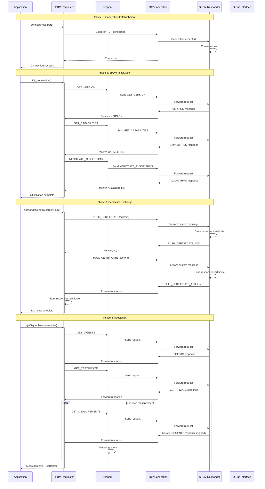

# SPDM (Security Protocol and Data Model) Implementation

## Overview

This is a comprehensive implementation of the DMTF SPDM (Security Protocol and Data Model) specification for secure device attestation and measurement. The implementation provides both SPDM Requester and Responder components with support for certificate exchange, measurements, and component integrity verification.

## Table of Contents

1. [Architecture Overview](#architecture-overview)
2. [Key Features](#key-features)
3. [Design Architecture](#design-architecture)
4. [Components](#components)
5. [Message Flows](#message-flows)
6. [Getting Started](#getting-started)
7. [Configuration](#configuration)
8. [Documentation](#documentation)
9. [Security Considerations](#security-considerations)
10. [Building and Installation](#building-and-installation)

---

## Architecture Overview

The SPDM implementation follows a client-server architecture where:

- **SPDM Requester**: Acts as the client, initiating attestation requests and certificate exchanges
- **SPDM Responder**: Acts as the server, responding to attestation requests and providing measurements
- **libspdm**: Core SPDM protocol library providing standard SPDM message handling
- **Custom Extensions**: Additional certificate exchange and provisioning capabilities



---

## Key Features

### Standard SPDM Operations
- ✅ **Version Negotiation**: SPDM protocol version negotiation (v1.2 support)
- ✅ **Capabilities Exchange**: Device capability discovery and negotiation
- ✅ **Algorithm Negotiation**: Cryptographic algorithm selection
- ✅ **Certificate Management**: Certificate chain retrieval and validation
- ✅ **Measurements**: Secure device measurement collection with signatures
- ✅ **Challenge-Response**: Device authentication via challenge-response

### Custom Extensions
- ✅ **Certificate Exchange**: Bidirectional certificate push/pull operations
- ✅ **Trust Store Management**: File-based certificate storage with DER/PEM support
- ✅ **Provisioning State**: Device provisioning state management
- ✅ **D-Bus Integration**: System integration via D-Bus interfaces
- ✅ **Component Integrity**: GraphQL-based component integrity verification

### Transport & Security
- ✅ **TCP/IP Transport**: Reliable TCP-based communication
- ✅ **Asynchronous I/O**: Boost.Asio-based async operations
- ✅ **Session Management**: Multi-session support with proper cleanup
- ✅ **Error Handling**: Comprehensive error handling and logging

---

## Design Architecture

### System Architecture Diagram



### State Machine Diagram

The SPDM session follows a well-defined state machine:



### Component Interaction Diagram



---

## Components

### Core Components

#### 1. SPDM Requester
- **Purpose**: Client-side SPDM implementation
- **Key Features**:
  - Connection management
  - Certificate exchange initiation
  - Measurement collection
  - Component integrity verification
- **Main Class**: `SpdmRequester`

#### 2. SPDM Responder
- **Purpose**: Server-side SPDM implementation
- **Key Features**:
  - Session management
  - Certificate exchange handling
  - Measurement provision
  - D-Bus integration
- **Main Class**: `SpdmResponder`

#### 3. Certificate Trust Store
- **Purpose**: Certificate storage and retrieval
- **Implementation**: File-based storage
- **Formats**: DER and PEM
- **Interface**: `CertificateTrustStore`
- **Implementation**: `FileCertificateTrustStore`

#### 4. Transport Layer
- **Protocol**: TCP/IP
- **Framework**: Boost.Asio
- **Classes**: `SpdmTcpClient`, `SpdmTcpServer`

---

## Message Flows

### Complete SPDM Session Flow



### Certificate Exchange Sequence

For detailed certificate exchange flow, see [CERTIFICATE_EXCHANGE_README.md](CERTIFICATE_EXCHANGE_README.md).

### Measurement Collection Sequence

For detailed measurement flow diagrams, see [SPDM_DESIGN_DIAGRAMS.md](SPDM_DESIGN_DIAGRAMS.md).

---

## Getting Started

### Prerequisites

- C++17 or later compiler
- Boost libraries (Asio, System)
- libspdm library
- OpenSSL
- Meson build system
- D-Bus development libraries

### Quick Start

#### 1. Build the Project

```bash
# Configure build
meson setup builddir

# Compile
meson compile -C builddir

# Install
sudo meson install -C builddir
```

#### 2. Start SPDM Responder

```bash
# Start the responder service
sudo systemctl start xyz.openbmc_project.spdm.responder.service

# Check status
sudo systemctl status xyz.openbmc_project.spdm.responder.service
```

#### 3. Run SPDM Requester

```cpp
#include "spdm_requester.hpp"

int main() {
    boost::asio::io_context io;
    
    // Create requester
    SpdmRequester requester(io, "/var/lib/spdm/certs/requester");
    
    // Connect to responder
    if (!requester.connect("localhost", 2323)) {
        return 1;
    }
    
    // Initialize SPDM connection
    if (!requester.init_connection()) {
        return 1;
    }
    
    // Exchange certificates
    auto [success, certPath] = requester.exchangeCertificates(
        "/var/lib/spdm/certs/requester_cert.der");
    
    if (success) {
        std::cout << "Certificate exchange successful\n";
        std::cout << "Responder cert stored at: " << certPath << "\n";
    }
    
    // Get measurements
    auto measurements = requester.getSignedMeasurements(
        {0, 1, 2}, "nonce123", 0);
    
    if (measurements) {
        std::cout << "Measurements retrieved successfully\n";
    }
    
    return 0;
}
```

---

## Configuration

### Default Paths

| Component | Path | Description |
|-----------|------|-------------|
| Responder Trust Store | `/var/lib/spdm/certs/responder` | Responder certificate storage |
| Requester Trust Store | `/var/lib/spdm/certs/requester` | Requester certificate storage |
| Responder Certificate | `/var/lib/spdm/certs/responder_cert.der` | Responder's own certificate |
| Requester Certificate | `/var/lib/spdm/certs/requester_cert.der` | Requester's own certificate |

### Environment Variables

- `SPDM_CERT_STORE_PATH`: Override default trust store path
- `SPDM_CERT_MAX_SIZE`: Override maximum certificate size (default: 4MB)
- `SPDM_PORT`: Override default TCP port (default: 2323)

### Custom Configuration

```cpp
// Custom trust store path
SpdmResponder responder(server, dbusObj, "/custom/cert/path");
SpdmRequester requester(io, "/custom/cert/path");

// Custom port
SpdmTcpServer server(io, 8888);
```

---

## Documentation

### Detailed Documentation

- **[SPDM_DESIGN_DIAGRAMS.md](SPDM_DESIGN_DIAGRAMS.md)**: Comprehensive design diagrams including:
  - System architecture
  - Component block diagrams
  - Sequence diagrams
  - State machines
  - Class diagrams
  - Data flow diagrams

- **[CERTIFICATE_EXCHANGE_README.md](CERTIFICATE_EXCHANGE_README.md)**: Certificate exchange implementation:
  - Message structures
  - Usage examples
  - Security considerations
  - Troubleshooting guide

- **[IMPLEMENTATION_SUMMARY.md](IMPLEMENTATION_SUMMARY.md)**: Implementation details:
  - Files created
  - Design decisions
  - Integration points
  - Testing strategy
  - Future enhancements

### API Documentation

Generate API documentation using Doxygen:

```bash
doxygen Doxyfile
```

---

## Security Considerations

### Current Implementation

✅ **Implemented Security Features**:
- Basic certificate validation (size, format)
- File-based secure storage
- Error handling and logging
- Session management
- Signature verification for measurements

⚠️ **Recommended Enhancements**:
- Certificate chain validation
- Certificate revocation checking (CRL/OCSP)
- Encrypted certificate storage
- Hardware security module (HSM) integration
- Access control and audit logging
- Transport layer security (TLS)

### Best Practices

1. **Certificate Management**:
   - Use strong key sizes (RSA 2048+ or ECC 256+)
   - Implement certificate rotation
   - Store private keys securely (TPM/HSM)
   - Validate certificate chains to trusted roots

2. **Network Security**:
   - Use TLS for transport encryption
   - Implement mutual authentication
   - Restrict network access with firewalls
   - Monitor for suspicious activity

3. **Access Control**:
   - Set proper file permissions (0600 for private keys)
   - Use principle of least privilege
   - Implement role-based access control
   - Audit all security-relevant operations

---

