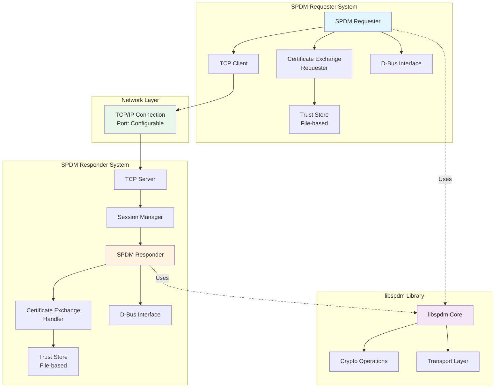
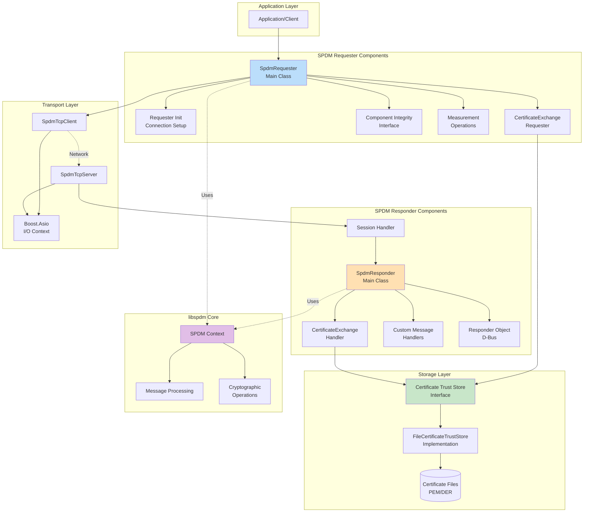
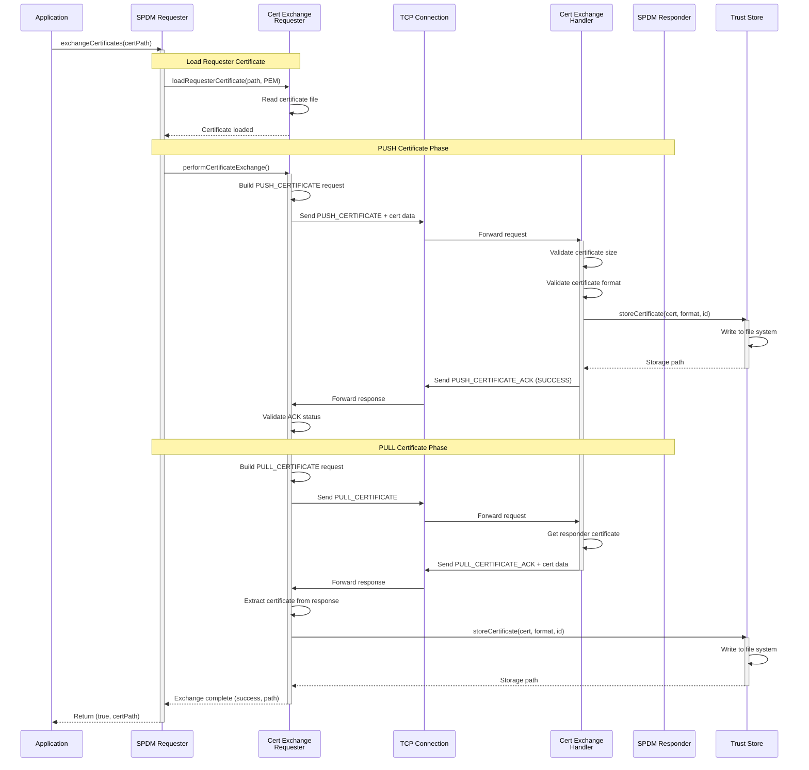
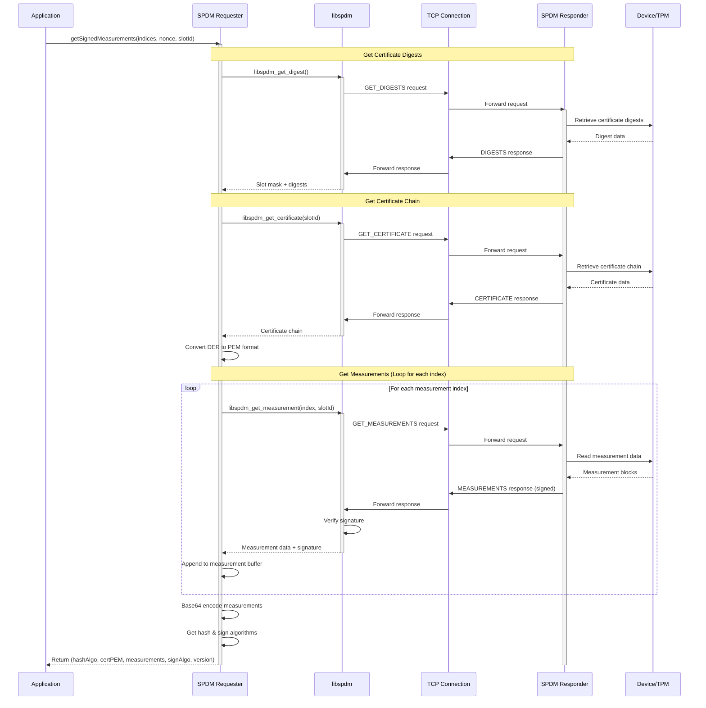
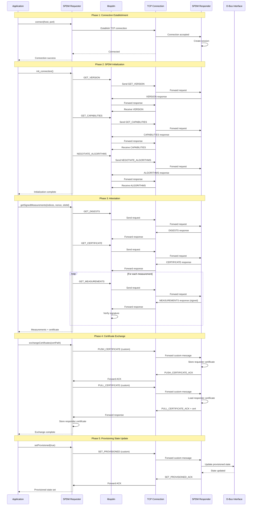
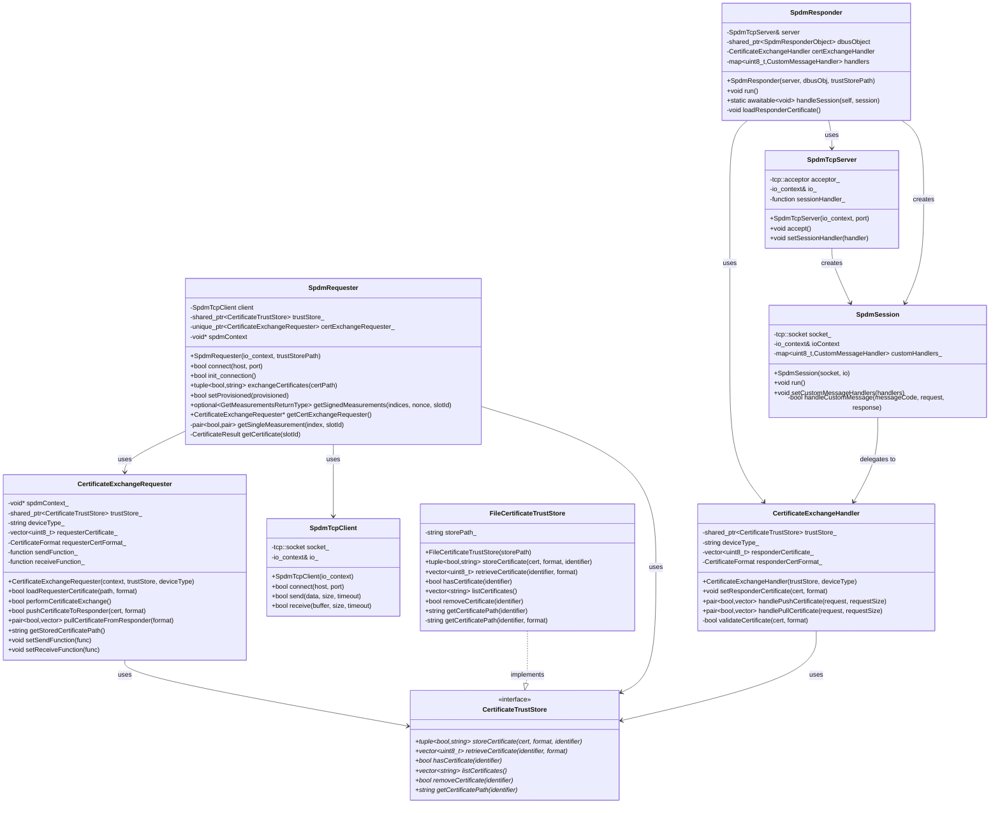
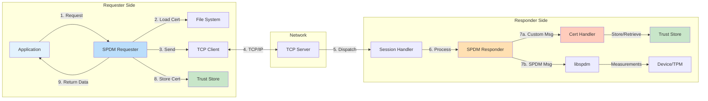
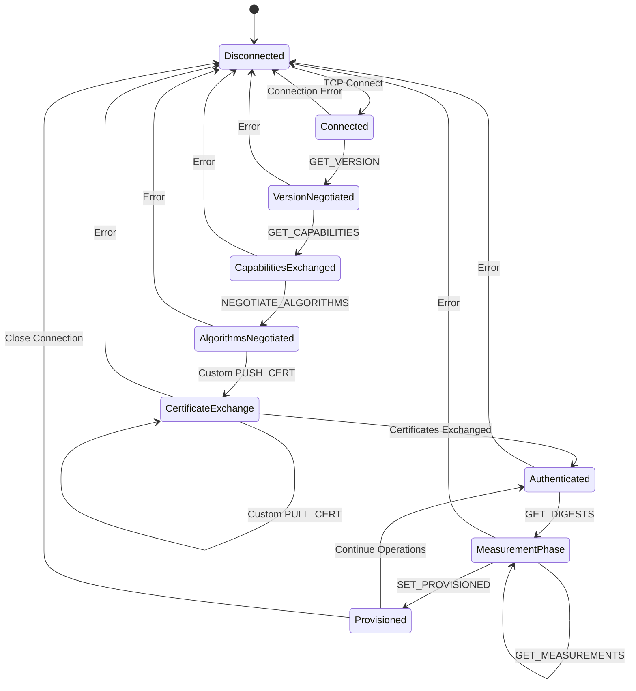

# SPDM Design Diagrams

This document contains comprehensive design diagrams for the SPDM (Security Protocol and Data Model) implementation, including architecture, component interactions, and message flows.

## Table of Contents
1. [System Architecture](#system-architecture)
2. [Component Block Diagram](#component-block-diagram)
3. [Certificate Exchange Sequence](#certificate-exchange-sequence)
4. [Measurement Flow Sequence](#measurement-flow-sequence)
5. [Complete SPDM Session Flow](#complete-spdm-session-flow)
6. [Class Diagram](#class-diagram)

---

## System Architecture

### High-Level Architecture Block Diagram

---

## Component Block Diagram

### Detailed Component Architecture

---

## Certificate Exchange Sequence

### Certificate Exchange Flow

---

## Measurement Flow Sequence

### Get Measurements Sequence

---

## Complete SPDM Session Flow

### Full SPDM Connection and Attestation Flow

---

## Class Diagram

### Core Classes and Relationships

---

## Data Flow Diagram

### Certificate and Measurement Data Flow

---

## State Diagram

### SPDM Session State Machine

---

## Notes

### Message Format
All SPDM messages follow the standard SPDM header format:
- **spdm_version**: SPDM protocol version (0x12 for v1.2)
- **request_response_code**: Message type identifier
- **param1, param2**: Message-specific parameters

### Custom Messages
The implementation uses vendor-specific message codes:
- **0x7E**: PUSH_CERTIFICATE / PUSH_CERTIFICATE_ACK
- **0x7F**: PULL_CERTIFICATE / PULL_CERTIFICATE_ACK
- **0x7D**: SET_PROVISIONED / SET_PROVISIONED_ACK

### Security Considerations
1. Certificates are stored in file system with appropriate permissions
2. Certificate validation includes size and format checks
3. Future enhancements should include signature verification and chain validation
4. Transport security (TLS) should be considered for production deployments

### Performance Considerations
1. File I/O operations are synchronous
2. Certificate exchange adds overhead to connection establishment
3. Measurement operations may be time-consuming depending on device
4. Consider caching frequently accessed certificates

---

## References
- DMTF SPDM Specification v1.2
- libspdm Documentation